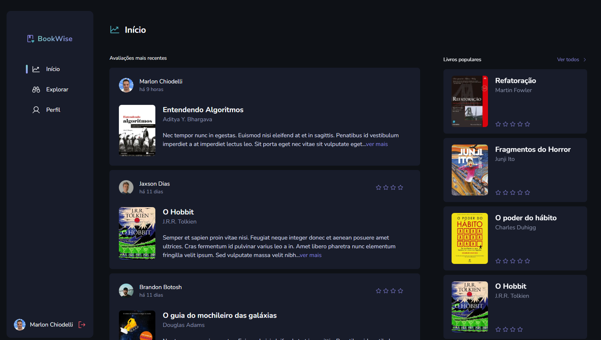
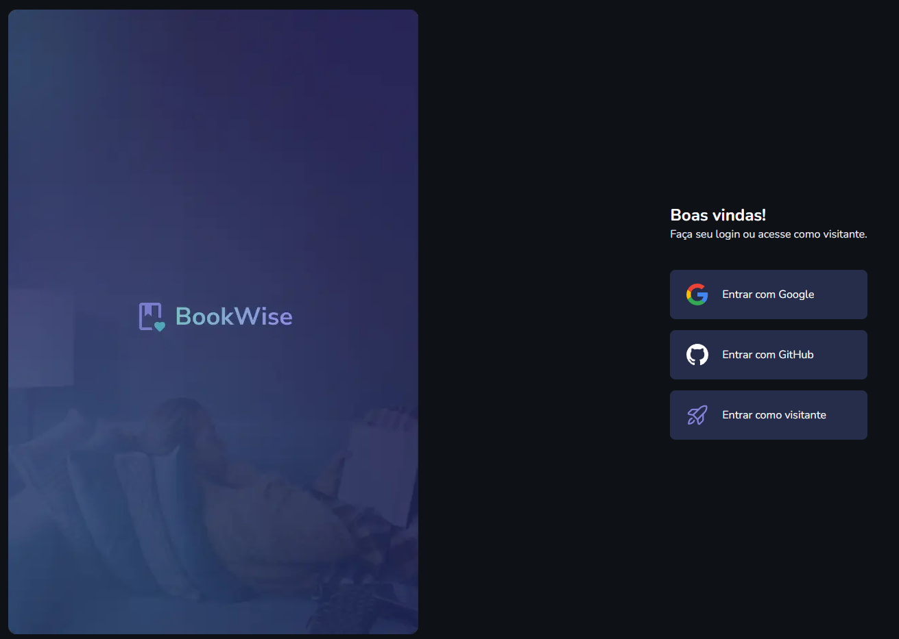
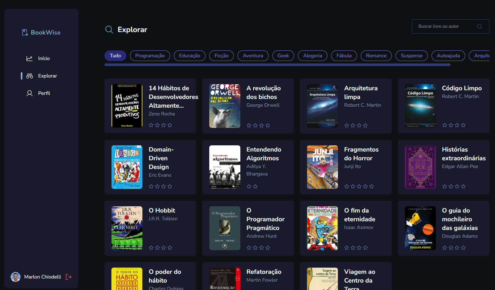

## Book Wise

Essa aplicação foi desenvolvida como desafio durante a formação React da Rocketseat.
É uma aplicação FullStack construída com Next. Consiste de uma aplicação FullStack para avaliação de livros onde o usuário pode avalizar os livros que já leu.
Como forma de me desafiar, fiz o projeto usando a versão mais atual do Next e usando o Tailwind css para estilização.

## Imagens

Login

  

Lista de livros

  

